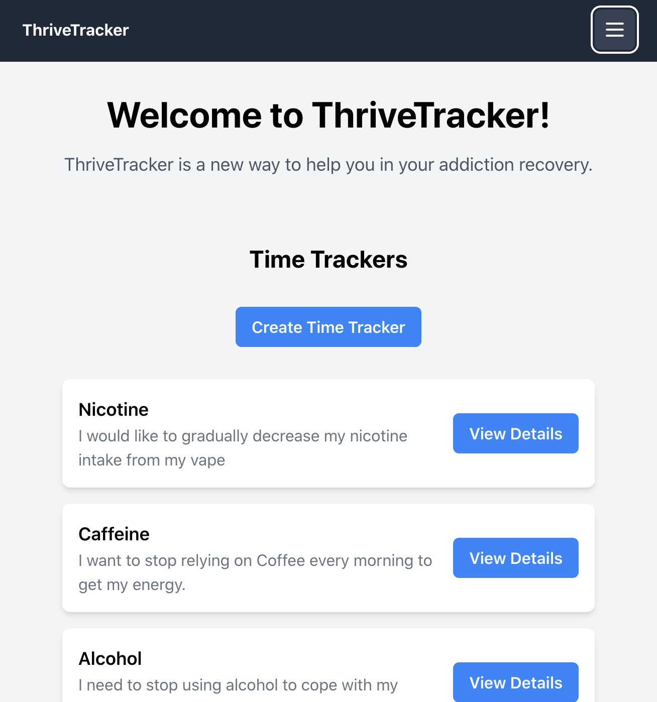

# Welcome to ThriveTracker!

## Take a look
[Thrivetracker has not yet been deployed](https://www.clappisonvet.com/wp-content/uploads/sites/222/2022/02/hang-in-there-baby.png)

# ThriveTracker App
Welcome to ThriveTracker, a new way to help you in your addiction recovery. ThriveTracker is a full-stack application built with React and Django featuring time tracking and progress monitoring functionalities to aid individuals in their addiction recovery journey.

## Features
- Create a time tracker for your addiction recovery.
- Track your progress and earn tokens every 30 days (in development).
- Add notes to your time tracker to help you stay on track (in development).
-Calculate your savings from not using your addiction (in development).

## Technologies Used
The following technologies were used in the development of ThriveTracker:

### Frontend
- React, a JavaScript library for building user interfaces.
- React Router DOM, a routing library for React applications.
- Tailwind CSS, a popular CSS framework for building responsive UIs.
- Axios, a promise-based HTTP client for the browser and Node.js.

### Backend

## Getting Started
To get started with ThriveTracker, follow these steps:

- Fork and clone this repository in your CLI.
- Navigate to the directory you just cloned.
- Run npm install to install necessary components.
- Run npm start to run the app in localhost.

## Future Updates
ThriveTracker is an ongoing project, and there are more features planned for the future, such as:

- Adding the ability to add notes to the time tracker to help users stay on track.
- Calculating and displaying the savings from not using the addiction to motivate users.
- Implementing reminders and notifications to help users stay accountable.
- Adding more customization options for time trackers, such as setting goals and milestones.

## Contribution Guidelines
I welcome contributions to my app! If you would like to contribute, please contact me for inquiries, to report bugs, or to propose improvements.

## About Me 
**Duncan Wood** 
 
[LinkedIn](https://www.linkedin.com/in/duncanwoodpro/) |
[Github](https://github.com/Duncan-Wood)
 